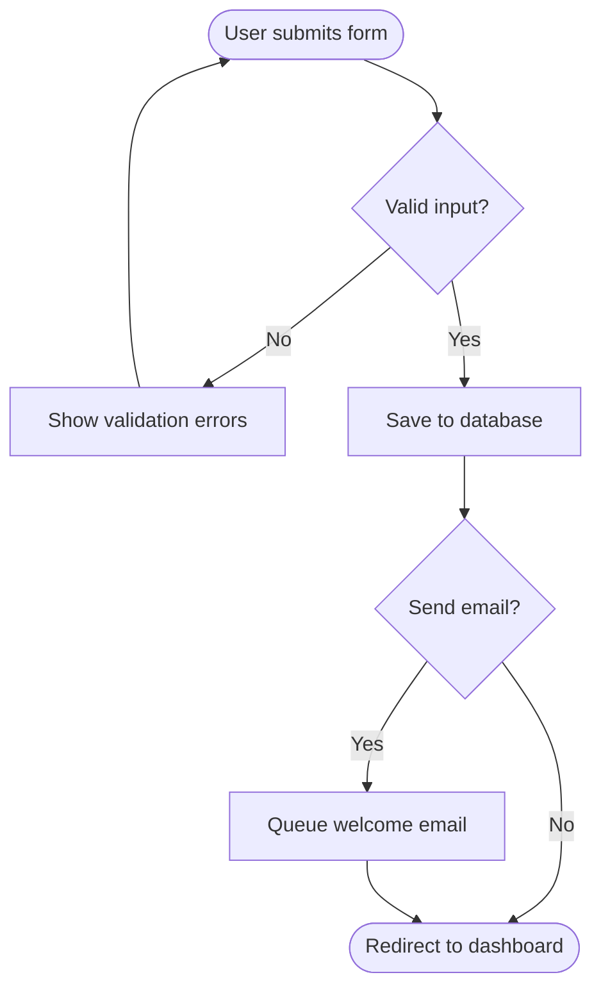
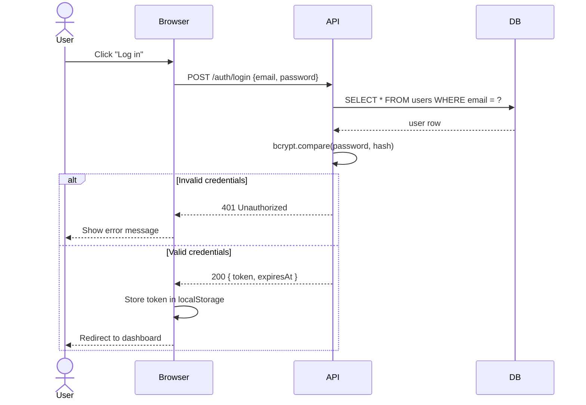
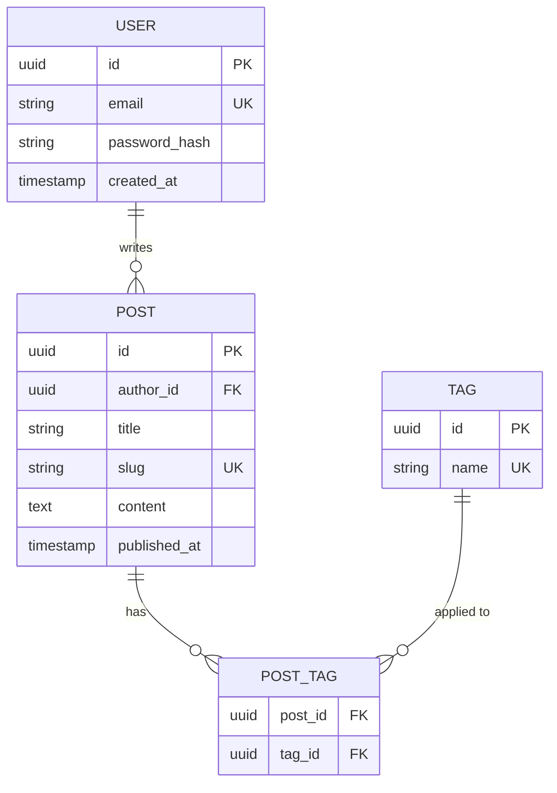
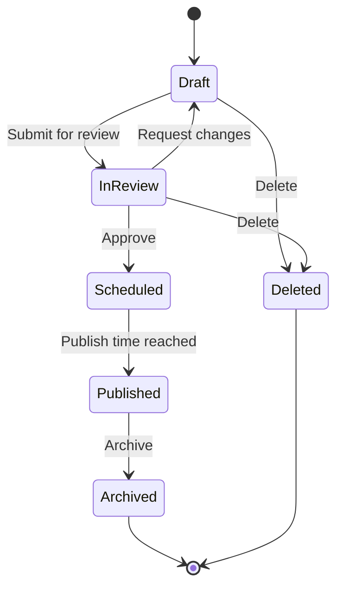
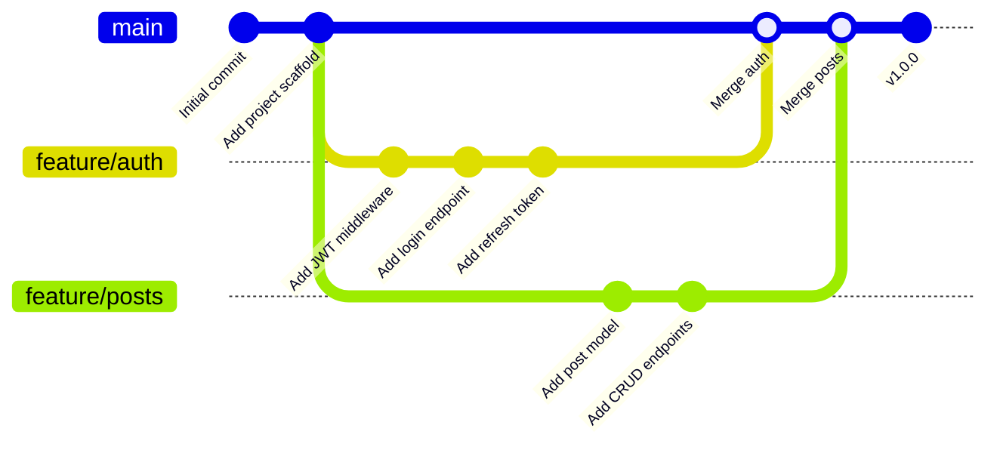

Mermaid lets you describe diagrams as text and renders them as SVG in the browser. No image files, no external tools — just a fenced code block with the `mermaid` language tag.

## Flowchart

Decision flows and pipelines are the most common use case. Mermaid's `graph` syntax handles both simple and branching paths cleanly.

## Sequence Diagram

Sequence diagrams are ideal for documenting API flows, authentication handshakes, or any interaction between two or more actors.

## Entity Relationship Diagram

ER diagrams help document database schemas alongside the posts that describe them.

## State Diagram

State diagrams work well for documenting lifecycle models — order states, subscription tiers, connection states.

## Git Graph

The `gitGraph` diagram type is a natural fit for documenting branching strategies.

---

Toggle the feature off at any time by setting `mermaid.enabled: false` in `themes/coldnight/_config.yml` — the blocks revert to plain highlighted code.
