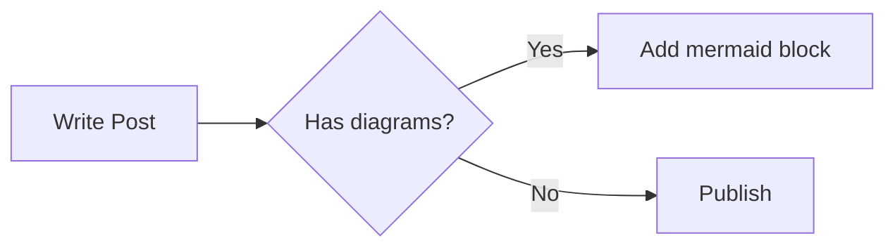

All theme options live in `themes/coldnight/_config.yml`. You can override any of them in the root `_config.yml` under `theme_config:` without touching the theme source.

## Navbar

```yaml
navbar:
  title: "My Blog"
  links:
    - name: Home
      url: /
    - name: Archive
      url: /archives
    - name: About
      url: /about
```

The active link is highlighted with `accent-light` text. A full-text search box is embedded in the navbar when `search.enabled: true`.

## Sidebar

```yaml
sidebar:
  position: right      # left | right | hidden
  widgets:
    - toc              # table of contents (post pages only)
    - recent_posts     # last 5 posts by date
    - tags             # all tags as pills
    - archives         # posts grouped by year
    - about            # author name, bio, avatar, social links
```

Set `position: hidden` to remove the sidebar entirely — the main content expands to fill the full width. The `toc` widget only renders on post pages and is suppressed when the post has no headings.

## Sponsor / coffee button

```yaml
sponsor:
  enabled: true
  label: "Buy me a coffee"
  url: "https://ko-fi.com/yourname"
```

Renders as an amber-tinted button in the navbar. Uses a dedicated colour palette distinct from the blue accent so it stands out without clashing.

## Social links

```yaml
social:
  github: "yourname"    # appended to https://github.com/
  twitter: "yourname"   # appended to https://twitter.com/
  rss: true             # adds <link rel="alternate"> and an RSS link in the footer
```

Social links appear in the navbar (GitHub icon), the footer, and the About sidebar widget.

## Index page grid

```yaml
grid:
  columns: 1    # 1 = list view, 2–6 = card grid
  rows: 3       # rows per page; per_page = columns × rows
```

`columns: 1` switches to list view (thumbnail left, text right). Any value ≥ 2 activates the card grid. `per_page` is computed automatically from `columns × rows`.

## Reading time and word count

```yaml
reading_time: true    # "4 min read" on cards and post header
word_count: true      # "1,240 words" in the post header
```

Both strip code blocks before counting so large snippets don't inflate the estimates.

## Table of contents

```yaml
toc:
  enabled: true
  max_depth: 3    # 2 = h2 only, 3 = h2 + h3
```

The TOC widget appears in the sidebar on post pages. It uses `IntersectionObserver` to highlight the heading currently in view. Set `enabled: false` to disable globally or omit the `toc` widget from `sidebar.widgets` to hide it without disabling the feature.

## Reading progress bar

```yaml
progress_bar: true
```

A 3 px bar fixed to the top of the viewport on post pages. Animates as you scroll; `pointer-events: none` so it never intercepts clicks.

## Search

```yaml
search:
  enabled: true
```

Full-text search powered by `hexo-generator-search`. The index (`search.json`) is built at generate time. Requires the search plugin config in `_config.yml`:

```yaml
search:
  path: search.json
  field: post
  content: true
```

Keyboard shortcuts: `/` focuses the search box; `↑`/`↓` navigate results; `Esc` closes the dropdown; `?` opens the shortcuts modal.

## Related posts

```yaml
related_posts: true
```

Shows up to 3 "You might also like" cards at the bottom of each post. Scoring is purely build-time: +2 pts per shared tag, +1 pt for a shared category. Posts with score 0 are excluded.

## Series navigation

```yaml
series: true
```

Posts with `series: "Series Name"` in their front-matter show a numbered nav strip above the post body. Parts are ordered by date (oldest = Part 1). The strip is suppressed when the series has only one post.

## Code blocks

```yaml
code:
  copy_button: true      # clipboard icon on each code block
  language_label: true   # language chip in the top-right corner
```


The language label is injected at build time via a Hexo `after_render:html` filter that adds `data-lang` to every `<figure class="highlight <lang>">` element so the CSS `::before` rule can display it.


## Mermaid diagrams

```yaml
mermaid:
  enabled: true     # convert ```mermaid blocks to rendered SVG
  theme: dark       # default | dark | neutral | forest
```

Fenced ` ```mermaid ` blocks are converted to `<div class="mermaid">` at build time and rendered client-side by the vendored Mermaid JS library. All Mermaid assets are self-hosted under `vendor/mermaid/` — no CDN requests.

````markdown

````

## Math (KaTeX)

```yaml
math:
  enabled: true    # render $...$ and $$...$$ as KaTeX HTML
```

Math is rendered at `hexo generate` time by KaTeX's Node.js API — zero JavaScript on the page. Only the KaTeX CSS file is served to the browser.

| Syntax | Usage |
|--------|-------|
| `$expr$` | Inline math within a sentence |
| `$$expr$$` | Display block, centred on its own line |

```markdown
Einstein's equation, $E = mc^2$, is well known.

$$\int_{-\infty}^{\infty} e^{-x^2}\, dx = \sqrt{\pi}$$
```

Math inside fenced code blocks is never processed — it stays as literal `$` text.

## Image captions

```yaml
image_captions: true
```

Standalone images with non-empty `alt` text are automatically wrapped in `<figure><figcaption>` at build time. The alt text becomes the visible caption below the image.

## External links

```yaml
external_links: true
```

Every link in a post body pointing to an external domain automatically receives `target="_blank" rel="noopener noreferrer"` and a small `↗` icon. Internal links and links with an existing `target` are left untouched.

## Permalink button

```yaml
permalink_button: true
```

Adds a copy-to-clipboard icon next to the post date. Clicking it copies the full permalink to the clipboard and shows a brief toast confirmation.

## LightGallery

```yaml
lightgallery:
  enabled: true       # load LightGallery assets
  auto_mount: true    # wire up all .post-body images automatically
  zoom: true          # pinch-to-zoom and scroll zoom
  thumbnail: true     # thumbnail strip at the bottom of the lightbox
```

Set `auto_mount: false` to opt out of automatic wiring and use only explicit gallery blocks. Add `class="no-gallery"` to individual images to exclude them from auto-mount. All LightGallery assets are self-hosted under `vendor/lightgallery/`.

## Cover images

```yaml
cover:
  default: ""          # fallback when no cover_image in front-matter
  aspect_ratio: "16/9"
```

Set `cover_image` in a post's front-matter to use a per-post image. If omitted, `cover.default` is used. If that is also empty, the card renders without a cover strip.

---

## Tag plugins

### note

Renders a callout box with an icon. Types: `tip` | `info` | `warning` | `danger`.


```

This is a **tip** callout. Body is rendered as Markdown.

```



Tip callout — for helpful hints and best practices.



Warning callout — for caveats and things to watch out for.


### gallery

Renders a LightGallery grid from a list of Markdown images. The optional number sets the column count (default 3).


```




```


### tabs

CSS-only tab switching via radio inputs — no JavaScript required.


```

<!-- tab JavaScript -->
console.log('hello')
<!-- endtab -->
<!-- tab Python -->
print('hello')
<!-- endtab -->

```


### download

Renders a styled download button. Add `external` at the end to badge links hosted off-site.


```


```


---

## Post front-matter reference

| Key | Type | Description |
|-----|------|-------------|
| `title` | string | Post title (H1 and browser tab) |
| `date` | datetime | Publication date, used for ordering and display |
| `categories` | list | First category shown as a pill on post cards |
| `tags` | list | Tags shown at the bottom of the post |
| `cover_image` | string | URL or path to the cover image |
| `excerpt` | string | Override the auto-generated excerpt on post cards |
| `pinned` | boolean | Promote to featured hero on index page 1 |
| `series` | string | Group post into a numbered series nav strip |

Use `<!-- more -->` in the post body to set the excerpt boundary instead of the `excerpt` key if you want the card to show a natural cut from the content.
